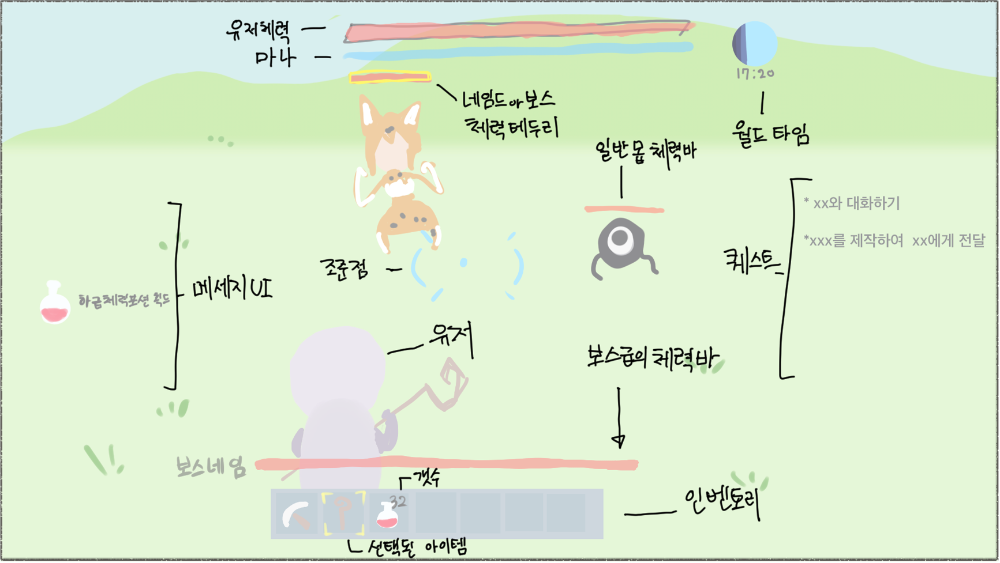

# [컨셉]

## 메인컨셉 : 생기
- 전체적으로 생기있는 분위기, 색감을 가진 게임  
- 생기를 위해 캐릭터들끼리 커뮤니케이션  
- 마이너스 감정의 요소들을 배제한다. 그러나 지루해지지 않게 완전히 배제하지는 않는다  
장르 : 생존, RPG

### 서브컨셉 : 캐릭터
- 몰입 할 수 있을 정도의 캐릭터들의 기본적인 스토리, 성격 등 캐릭터성을 만든다.

### 서브컨셉 : 모험
- 성장형 게임에 모험 요소는 거의 필수다 싶이 아주 좋은 시너지를 가지고있다.
- 모험은 언제나 두근두근하다. 모험을 통해 집중도를 높인다.

### 서브컨셉 : 조화
- 현실에서 일어날 수 있는 일과 판타지에서만 가능한 것을 조합시켜서 친밀함과 특별함을 합쳐 특별한 경험을 준다.

### 서브컨셉 : 자유
- 게임의 메인요소가 아니더라도 소소하게 즐길 수 있는 흥미유발을 위해 여러가지 요소를 넣는다.

### 서브컨셉: 스케일
- 좁은 지역이 아닌 다양한 타입의, 간결한 한가지가 아닌 다양해 보이는 지역을 만든다.

  

# [관련 이미지 작품묘사 & 동영상]
- 기본 UI 및 게임스타일 이미지

- 동영상
1. [마이 타임 앳 포샤] https://youtu.be/h69RBaEHCRo
2. [젤다의 전설 브레스 오브 더 와일드] https://youtu.be/paosvuLRgFc
3. [리틀 위치 노베타] https://youtu.be/jKg04Imf7qY

  

# [구성 요소]

 

## 1. 메커니즘

[성장]  
가면 갈수록 마을을 크게 키운다  
직접 점점 교류할 엔피시들을 모으며 모험심과 호기심 자극  
[지속적]  
패배 등 의 요소는 사망, 게임오버 가 아닌 기절하여 일정 패널티와 함께 집에서 깨어난다  
엔딩을 향하는 것 보다 생산과 이벤트 위주  

 

## 2. 이야기
초반 베이스 스토리는 주인공은 용사와 같은 공을 세운 인물로 그 보상으로 하나의 마을에 정착하는 스토리 베이스의 귀농형 게임  
주로 이벤트성 스토리며 비선형적 스토리  
퀘스트의 형식은 의뢰형식, 이벤트형식 이 있다.

 

## 3. 미적요소

[캐릭터디자인]  
엔피시 별 특징이 살아있고 각각 능력도 다릅니다  
[분위기]  
밝은 색채 위주  
[디테일]  
그 외 둘러볼만한 재미가 있게 배경에도 디테일을 살린다

 

## 4. 캐릭터요소

[스토리]  
캐릭터들의 이미지를 정해줄 스토리를 구성한다  
[개성]  
성격,좋아하는것 등 각자의 개성을 만든다  
[도감]  
필요하다면 엔피시에 대한 도감도 추가 가능성 있음  
(엔피시별 메모기능으로 직접 설명 추가하면 재미있을 것 같음)  
어떤 캐릭터들은 싸워서 마을로 데려 올 수 있음

 

## 5. + 그 외
- 판타지와 현실적 요소의 믹스 Ex)판타지 적인 요리재료로 요리를 하여 다양하게 사용 가능 혹은 그 반대
- 근접보단 주로 원거리 계열
- 무기와 같은 기본적인 것을 제공하는 엔피시는 미리 배치
- 사냥이 중심이되, 개인 홈을 만들어 사냥 외의 비중도 상당히 높일 예정

  

# 기타 계획 및 개인의견
- 서브컨셉 등 방향성은 차후 개선 등 달라질 수 있음  
- 스타듀밸리 와 같은 생산과 이벤트 위주의 게임을 만들어 보고 싶다.  
- VR 개발이 충분히 가능하다면 개발 가능성 있음 (게임방식이 크게 달라질 수 있음)
개발 플랫폼 : Unity 엔진
