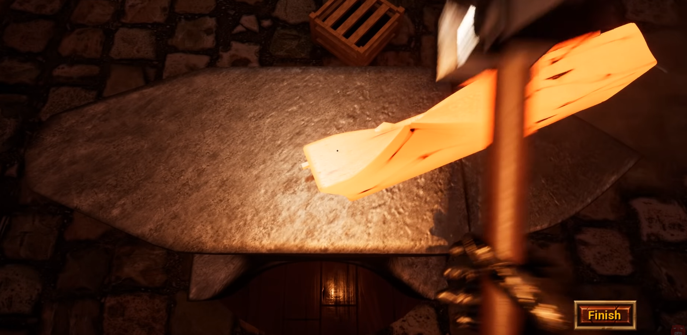
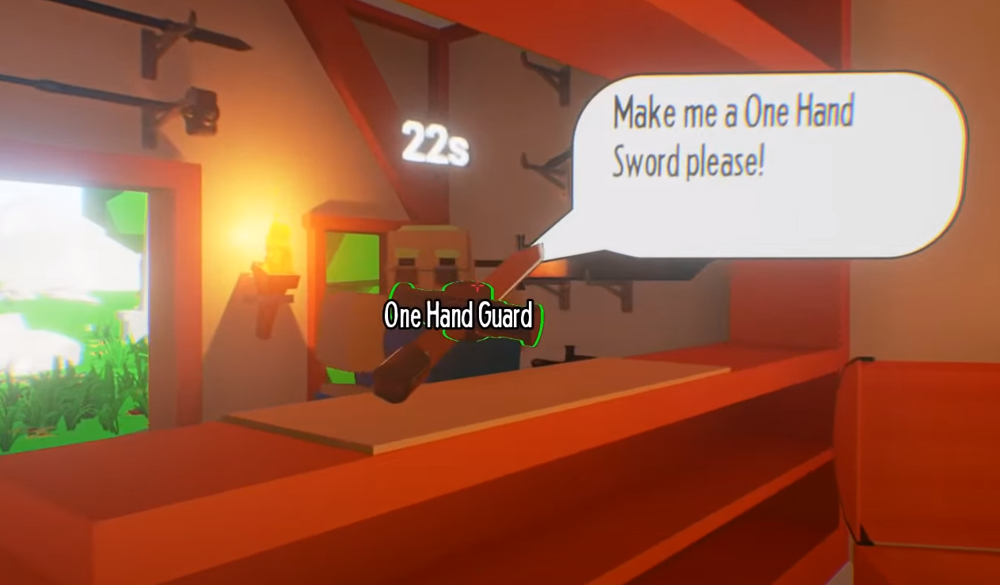
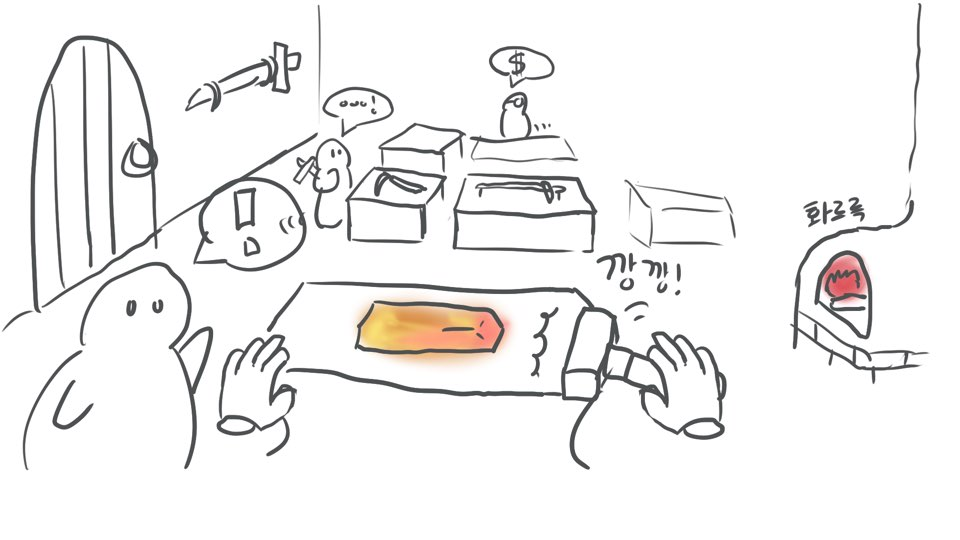
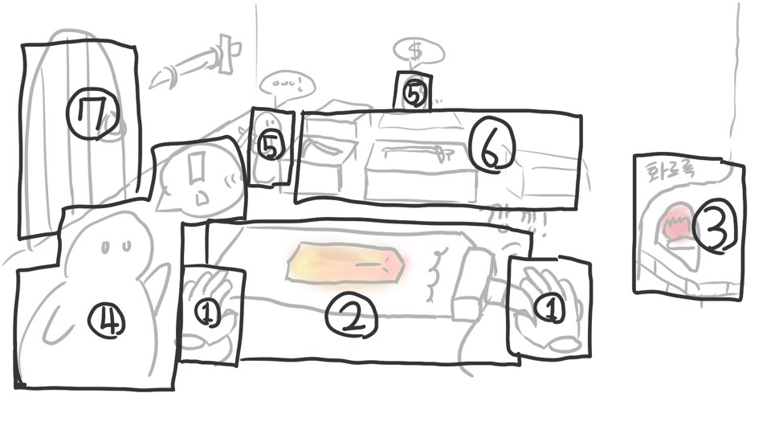
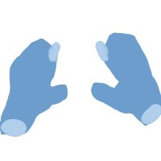
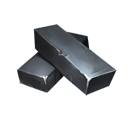
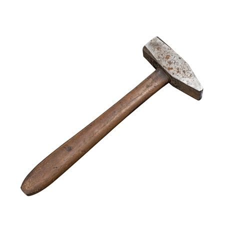
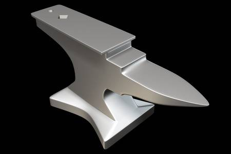
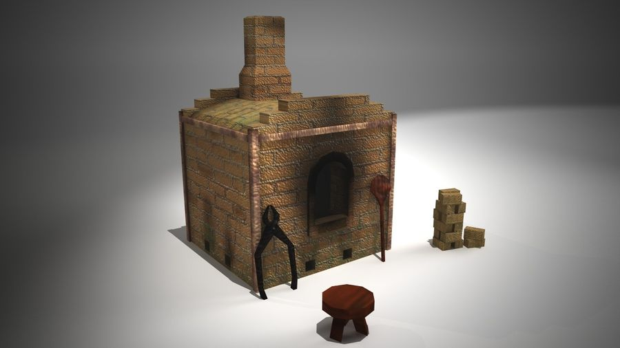
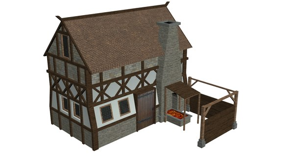

md 테스트  

|1|2|3|  
|:---------:|:---------:|:---------:|  
|1|2|3---|  
|4|5|6|

# 게임명 : Smith Simulator VR
[1. 컨셉](#1-컨셉)  
[2. 관련 이미지, 동영상 작품묘사](#2-관련-이미지-동영상-작품묘사)  
[3. 대표 이미지](#3-대표-이미지)  
[4. 대표 이미지 기반 작품 묘사](#4-대표-이미지-기반-작품-묘사)  
[5. 게임 구성 요소](#5-게임-구성-요소)  
[6. 게임 시스템 디자인](#6-게임-시스템-디자인)  
[7. 개발 요구사항 & 흐름도](#7-개발-요구사항-흐름도)  
[8. 개발 작업 일정](#8-개발-작업-일정)

# 1. 컨셉

## 메인컨셉 : 대장장이
- 무기, 도구를 제작하는 시뮬레이터 형식의 게임이다.
- 무기, 도구를 제작해서 판매도 가능하고 직접 사용도 가능하다.

### 서브컨셉 : 힐링
- 느긋하게 큰 시간제한 없이 만들 수 있다.
- 상실감을 배제하기 위해 기초적인것들은 전부 실패요소가 거의 없다.

### 서브컨셉 : 장인정신
- 좀 더 많이 칠수록, 좋은 재료를 쓸수록 좋아진다.
- 직접적인 정보로는 다 볼 수 없는 좋은 재료를 보는 안목을 직접 찾을 수 있게 한다.(재료의 보이지않는 스테이터스)

### 서브컨셉 : 자유로운 생산
- 딱 정해진 무언가를 만든다기 보단 일정 틀만 지키고 좀 더 자신의 마음대로 만들 수 있다.

### 서브컨셉 : 판타지
- 판타지풍으로 여러가지 현실에는 없는 흥미로운 재료를 얻을 수 있다.
- 속성부여, 마법무기, 마물 등 판타지적인 요소

  

# 2. 관련 이미지, 동영상 작품묘사
## 2.1. 관련 이미지
### 두드려서 제작중인 모습
  

### 완제품 판매중인 모습

## 2.2. 관련 동영상

# 3. 대표 이미지

  

# 4. 대표 이미지 기반 작품 묘사

1. **플레이어의 손,컨트롤러.** 상호작용이나 메뉴를 눌러 인벤토리를 열거나 퀘스트, 설정 등 UI 기능을 열 수 있다.
2. **모루.** 만들 목표를 정하고 주로 광물을 두드려서 필요한 부품을 제작한다.
3. **가마.** 광물을 제련, 가공을 위해 가열하거나 목재를 넣어 온도를 높이거나 등 의 작업을 할 수 있다.
4. **의뢰하는 NPC** 플레이어에게 직접 주문제작 의뢰하는 NPC이며 까다로운 만큼 더욱 특별한 보상을 준다.
5. **진열된 물건을 보는 NPC.** 플레이어가 제작한 물건들을 둘러보며 취향에 맞게 구매하거나 구경한다.
6. **진열대.** 플레이어가 제작한 물건을 진열하여 판매 할 수 있다.
7. **밖으로 나가는 문.** 상점이나 자원을 얻으러 나갈 수 있다.  
+. 그 외 나무를 다듬거나 기타 제련을 위한 제작대 추가

# 5. 게임 구성 요소

 

## 5.1. 메커니즘

[목표]  
- 다양한 도구들을 만들어라.  
- 대장간을 성장시켜라.  

[재미요소]  
- 딱 정해진 제약에서 벗어나서 입맛대로 만든다.
- 직접 재료까지 전부 구해온다.
- NPC가 직접 의뢰를 부탁하기도 한다.

 

## 5.2. 이야기

모험가 출신인 플레이어는 한 망해가는 대장장이가 시간안에 정해진 양을 못만든다면서 플레이어를 붙잡아 도움을 요청한다.  
그 과정에서 플레이어가 대장장이에 재능을 가지고 있는걸 알게 된다. 대장장이는 이제 질린다며 도망치듯이 물려주게된다.

 

## 5.3. 미적요소

[간단]  
- 보기 편한 느낌으로 간단한 그래픽.  

[현장감]  
- VR컨텐츠로 직접 보고 느낀다.  

[제작]  
- 자신의 미적감각을 살려 형태를 직접 정할 수 있다.

 

## 5.4. 기술
[개발환경]  
- Windows 10 pro  
- HTC VIVE VR  
- Clip Studio  
- Unity 2020.1.3f1  

 

# 6. 게임 시스템 디자인

## 6.1. 게임 오브젝트 분해  

|연번|오브젝트 이름|오브젝트 이미지|  
|:---:|:---:|:---:|  
|1|플레이어 손||  
|2|NPC||  
|3|괴||  
|4|망치||  
|5|모루||  
|6|가마||  
|7|대장간||  

## 6.2. 파라미터(속성)
### 6.2.1. 플레이어 손
|속성|속성값|설명|
|:---:|:---:|:---:|
|이동속도|3|손이 가리키는 방향이나 바라보고 있는 방향으로 가는 속도|

### 6.2.2. NPC
|속성|속성값|설명|
|:---:|:---:|:---:|
|선호 물건|낫|NPC별 선호하는 물건|
|호감|0/100|이 NPC에게 적합한 행동을 할 시 오른다. 방문 빈도 등 에 영향을 끼친다.|

### 6.2.3. 괴
|속성|속성값|설명|
|:---:|:---:|:---:|
|종류|철|괴의 종류|
|내구성|50|괴가 버티는 내구성|
|강도|50|괴의 튼튼함|
|마력|0|괴에 포함되어있는 마력|

### 6.2.4. 망치
|속성|속성값|설명|
|:---:|:---:|:---:|
|공격력|5|공격력, 물건을 가공하는 힘|
|섬세함|2|내구성을 유지해주는 능력|

## 6.3. 행동
### 6.3.1. 플레이어 손
|행동|설명|
|:---:|:---:|
|잡기|물체를 잡거나 놓는다|
|휘두르기|물체를 휘둘러 타격을 준다|
|탐색하기|가리키고 있는 물건의 기본적인 정보를 탐색한다|

### 6.3.2. NPC
|행동|설명|
|:---:|:---:|
|둘러보기|대장간 내부에서 진열중인 상품을 둘러본다|
|물건구매|물건을 구매한다|

## 6.4. 상태
6.4.1. 괴
|현상태|전이상태|설명|
|:---:|:---:|:---:|
|기본상태|달궈짐|달궈짐으로써 가공 가능하게 된다|
  

# 7. 개발 요구사항
- 시작화면 -> 시작, 옵션, 조작법
- 시작은 대장간에서 시작한다.
- 직접 컨트롤러를 휘둘러 작업하는 위주로 만든다.  
- 컨트롤러는 크게 들기, 정보 보기, 도구 사용하기 등의 작업을 할 수 있다.  
- 판매형태는 두가지다. 진열판매와 의뢰납품 판매  
- 대장간에서 장비를 제작하고 진열대에 진열 하거나 개인 의뢰자에게 납품 할 수 있다.  
- 성장의 방향을 잡아주기 위한 메인 퀘스트, 이벤트 가 있다.  
- 대장간에선 창고, 제조를 위한 작업대들, 외부로 나가기, 진열대, 기본제작법 등 이 있다  
- 제작할때 너무 일정한 틀이 아닌 손잡이가 과하게 긴 것 같이 마음대로 커스텀 할 수 있는 부분이 있어야 한다.  
- - 그 점을 통해 의뢰납품에도 추가 요구사항이 있을 수 있다  
- - NPC의 성향에 따라 커스텀을 추가하면 좋아하는 NPC도 있고 싫어하는 NPC도 있다.  
- 장비의 제작은 보통 크게 손잡이, 날 로 구성되어있다.
- 재료는 외부로 나가거나 상점에서 구매하여 재료를 수급할 수 있다
- 흥미를 돋구기 위한 이상하지만 엉뚱하면서도 재미있는 업적을 만든다.
- 추가적인 제작방법은 후에 레시피 구매나 대장간이 성장, 퀘스트를 완료하면서 획득할수있다.
- 추가적인 제작대 강화, 구매도 마찬가지
- 이상하고 개인적으로 추상적인걸 만들어도 상품으로 인정 해 준다
- 제련시 재료의 어느 부위를 치냐 에 따라 재료의 퍼지는 방향이 다르다
- 일정 이상 쇠를 치면 조금씩 조금씩 더 강하게 만들 수 있다. 그러나 일정 수치에 수렴한다.

# 기타 계획 및 개인의견
- 서브컨셉 등 방향성은 차후 개선 등 달라질 수 있음  
- 스타듀밸리 와 같은 생산과 이벤트 위주의 게임을 만들어 보고 싶다.  
- 장신구 같은것도 제작하면 어떨까
- 쇠로 만들어 진 것들이 뭐가 있을지 더 생각해보자 예를들어 숟가락 같은
- 시기에따라 판매량 상승하는 도구가 있는 이벤트는 어떨까
- 도구에 속성부여

# 8. 개발 작업 일정
**1주차 ~ 4주차 기본 베이스 작업주차**
|**작업내용**|1주차|2주차|3주차|4주차|5주차|6주차|
|-------|:---:|:---:|:---:|:---:|:---:|:---:|
||||||||
|메뉴, UI||Main Menu|Menu On Controller||||
|오브젝트 기본 배치|Work Space|Work Space|||||
|VR세팅|Controller, Head|Controller Key, Teleport|Move, Init forwordView||||
|**오브젝트 상호작용(물리)**|Trigger, Grip|Click = Change|Object끼리 충돌|->|||
|맵|||->|->|->||
|오브젝트 재배치|||||->|->|
|모델, 그래픽||||->|->|->|

^오브젝트 상호 작용이란 어디에 무엇을 가져다 대냐 와 같은 물리작용
